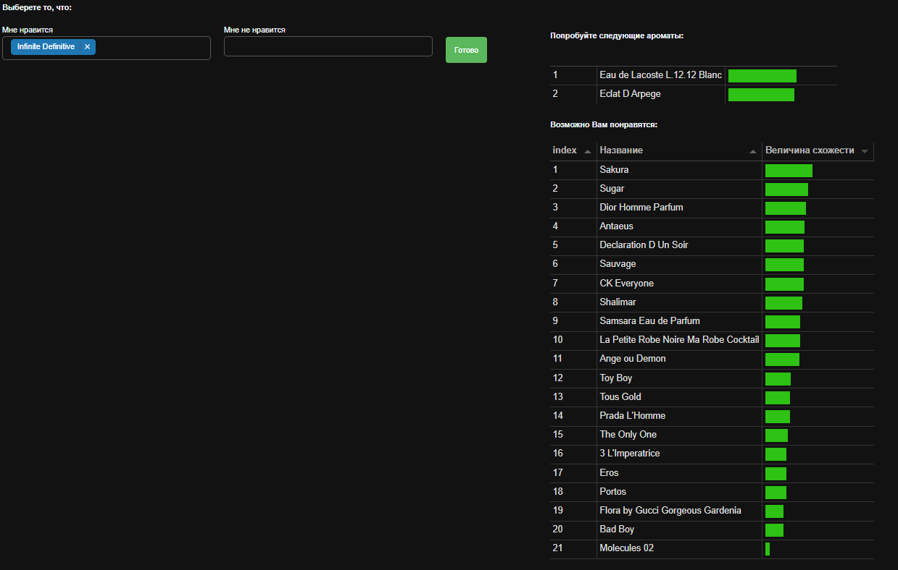
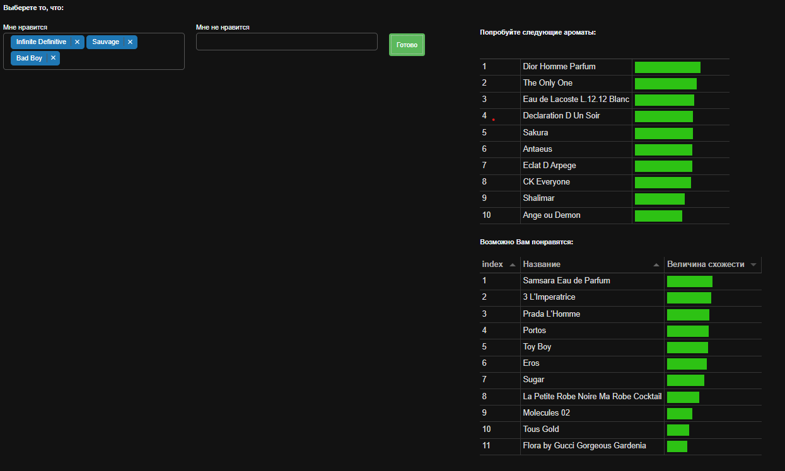
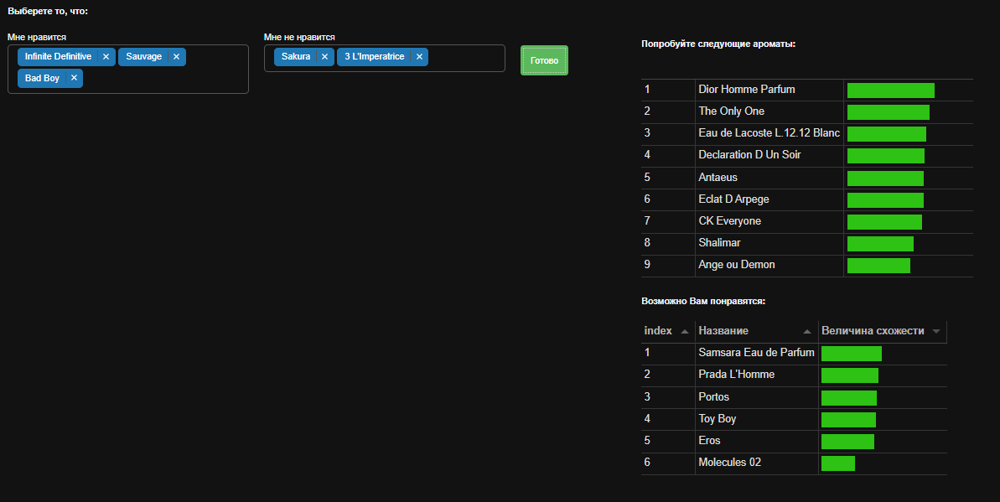

# Результаты
## 1. Задача 1: 
**Вход**: 1 объект (затравочный). 

**Выход**: список рекомендаций, ранжированный по убыванию близости с затравкой.

**Результат:**

## 2. Задача 2: 
**Вход**: массив объектов (лайков). 

**Выход**: сформированный ранжированный список рекомендаций.

**Результат:**

## 3. Задача 3: 
**Вход**: массив затравочных объектов (лайков) и массив дизлайков.

**Выход**: сформированный ранжированный список рекомендаций.

**Результат:**
