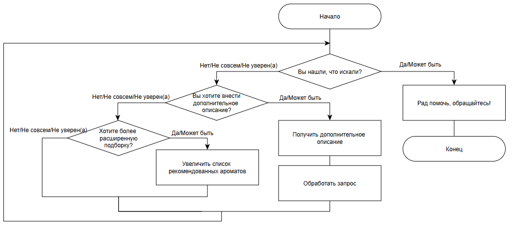

### 1. Хранятся ли в дереве (ЛР1-2) данные о вершинах дерева, не являющихся листьями дерева?
Да, хранятся данные о вершинах дерева, не являющихся листьями дерева для доступа листьев дерева
### 2. Каков результат ЛР2? 
Меры близости (Евклидово и Манхэттенское расстояния, мера Жаккарда, косинусная и ассоциативная меры близости)
### 3. Сколько тестов Вы написали в ЛР8?
27 тестов для проверки каждой ситуации ввода текста (Соответствует ли каждый ввод заданному шаблону вопросов?)
### 4. Как устроена Ваша диалоговая система?
Диаграмма диалоговой системы

### 5. Какие слова Вы считаете ключевыми для каждой группы возможных вопросов?
    Ключевые слова для каждой группы вопросов:
    - Нужна помощь: Посоветуй(те), хочу
    - Нравится/положительное отношение: нравится, обожаю,люблю
    - Не нравится/ отрицательное отношение: Совсем, не переношу,не нравятся, не подходит
    - Похожий на другой: похожий на
    - Ориентация по чему-нибудь (стране, бренду, ...): соответствующие слова(Guerlain, Gucci, немецкие, французские, ....)
### 6. Какие библиотеки для обработки русского языка Вы использовали?
pymorphy2
### 7.Использовали ли Вы регулярные выражения?
Да, регулярные выражения применяются в обработке входного текста

